# Demo of the Website

<table width="100%">

  <!-- HOME SECTION -->
  <tr>
    <td colspan="2" align="center">
      <h3>🏠 Home View</h3>
      
Main hero dashboard of Mask Vision with navigation and footer section visible.

    </td>
  </tr>
  <tr>
    <td>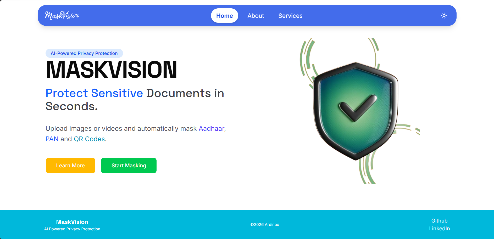</td>
    <td>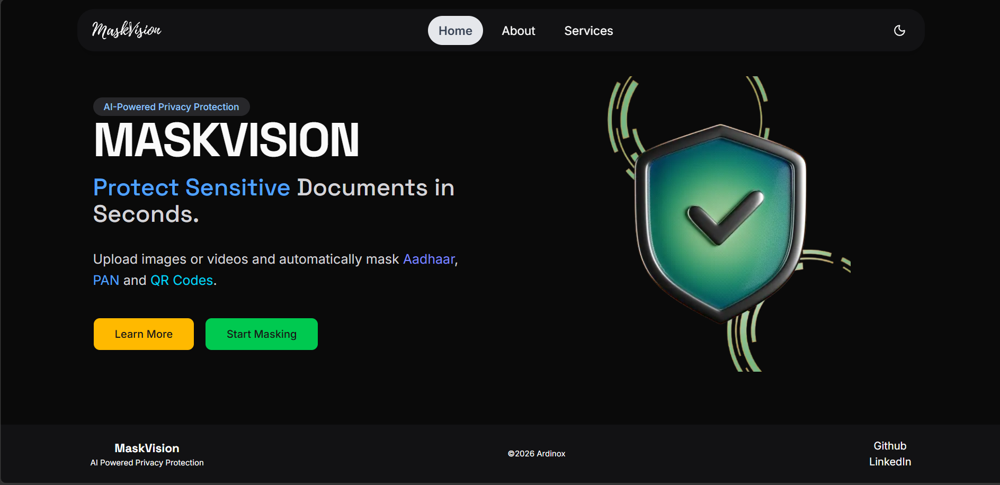</td>
  </tr>

  <!-- ABOUT SECTION -->
  <tr>
    <td colspan="2" align="center">
      <h3>ℹ️ About Overview</h3>
      
Detailed insight into system architecture and Project demo.

    </td>
  </tr>
  <tr>
    <td>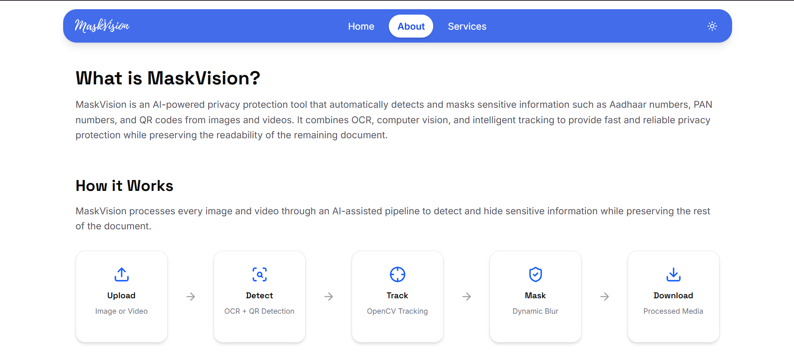</td>
    <td>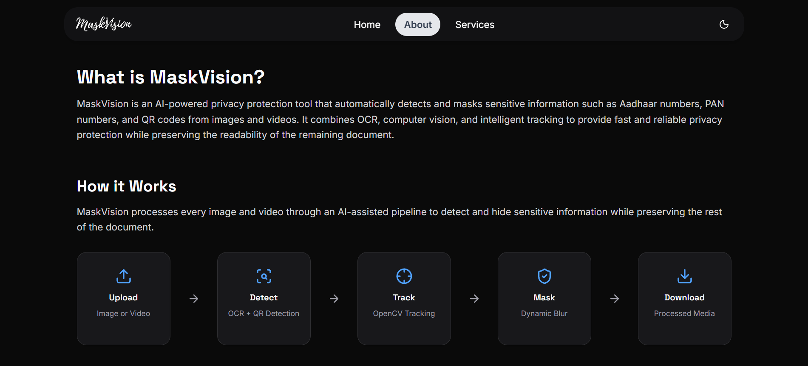</td>
  </tr>

  <tr>
    <td colspan="2" align="center">
      <h3>📸 Image Demo</h3>
      
A side by side comparision

    </td>
  </tr>
  <tr>
    <td>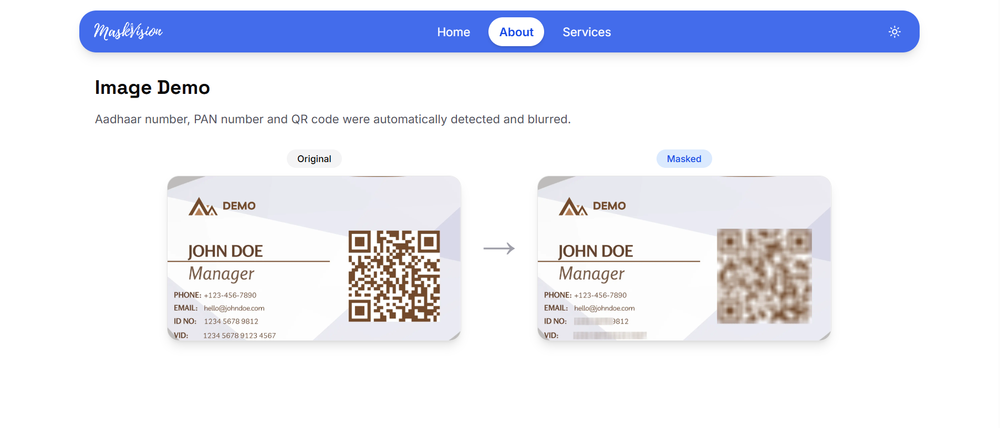</td>
    <td>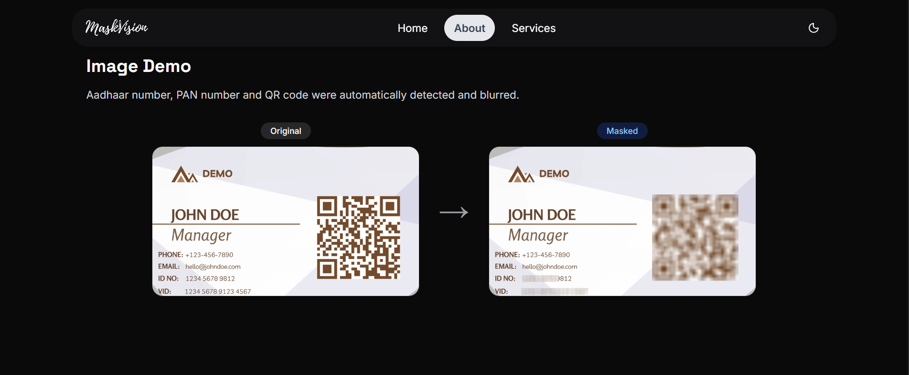</td>
  </tr>

  <tr>
    <td colspan="2" align="center">
      <h3>🎬 Video Demo</h3>
      
This is a still image from the demo video

    </td>
  </tr>
  <tr>
    <td>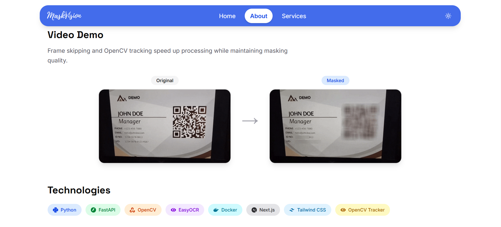</td>
    <td>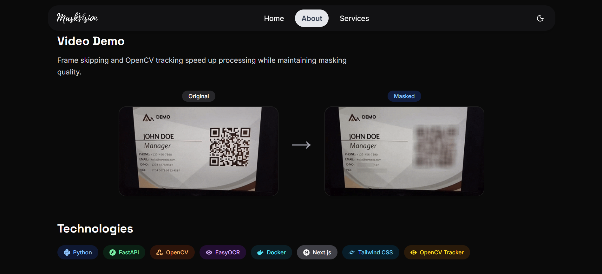</td>
  </tr>

  <!-- 4. SERVICES SECTION -->
  <tr>
    <td colspan="2" align="center">
      <h3>📤 Upload</h3>
      
Upload or drag & drop the file you want to mask

    </td>
  </tr>
  <tr>
    <td>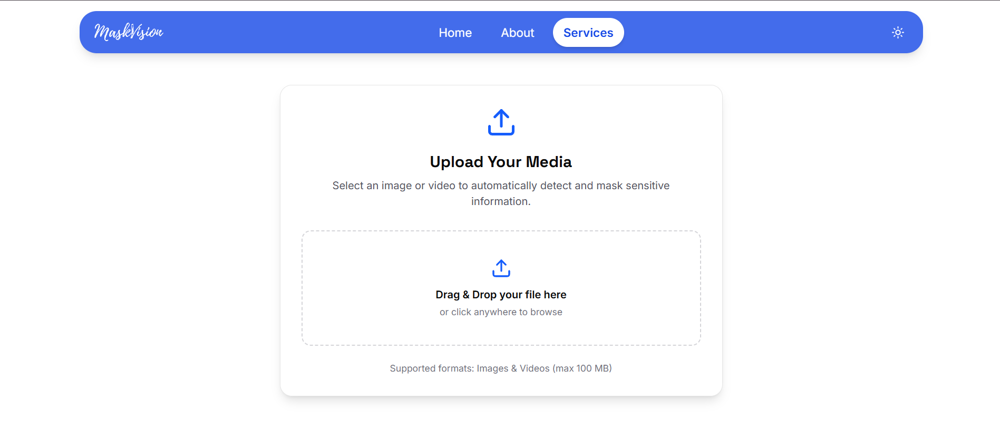</td>
    <td>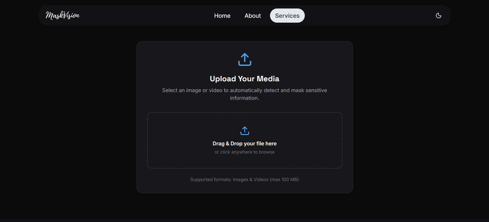</td>
  </tr>

  <tr>
    <td colspan="2" align="center">
      <h3>👨🏻‍💻 Preview</h3>
      
You can verify the media you are sending for Processing

    </td>
  </tr>
  <tr>
    <td>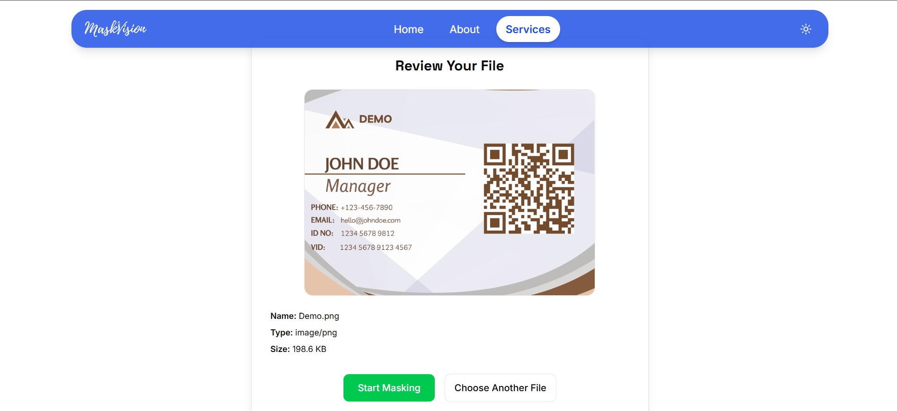</td>
    <td>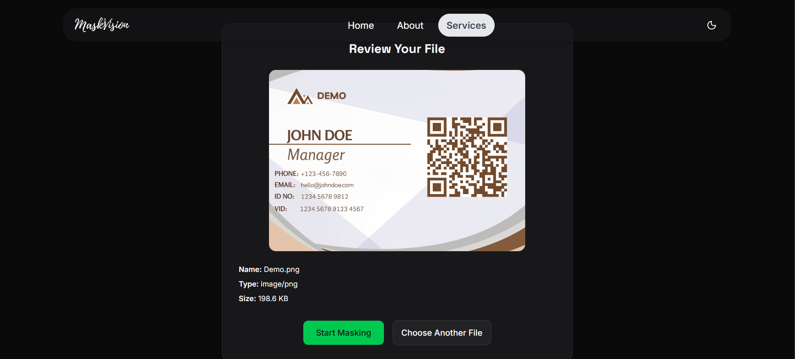</td>
  </tr>

  <tr>
    <td colspan="2" align="center">
      <h3>⚙️ Processing</h3>
      
This can take some time to Process

    </td>
  </tr>
  <tr>
    <td>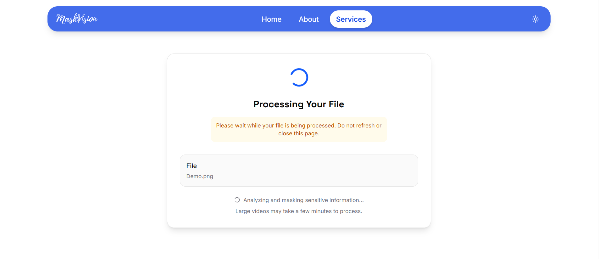</td>
    <td>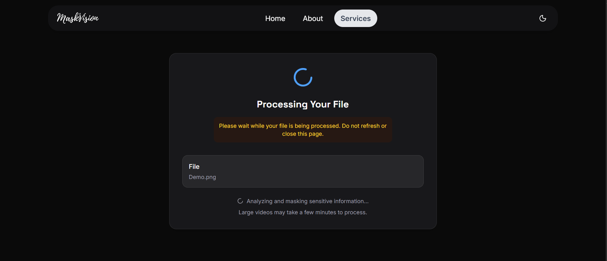</td>
  </tr>

  <tr>
    <td colspan="2" align="center">
      <h3>⚡ Results </h3>
      
After successfull processing the files can be downloaded

    </td>
  </tr>
  <tr>
    <td>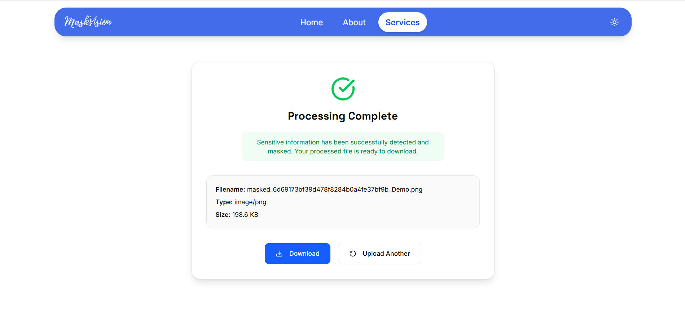</td>
    <td>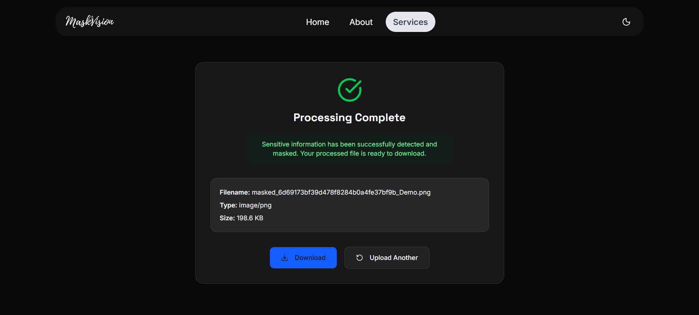</td>
  </tr>
</table>